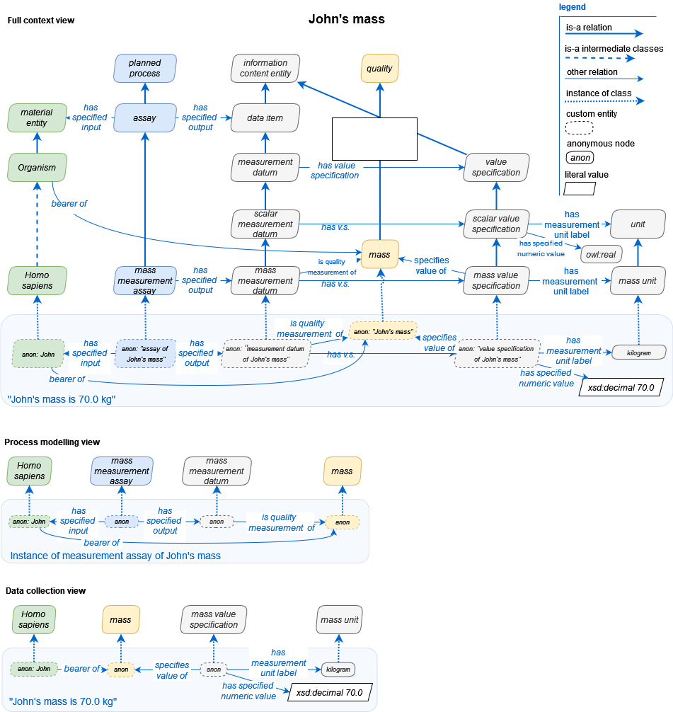
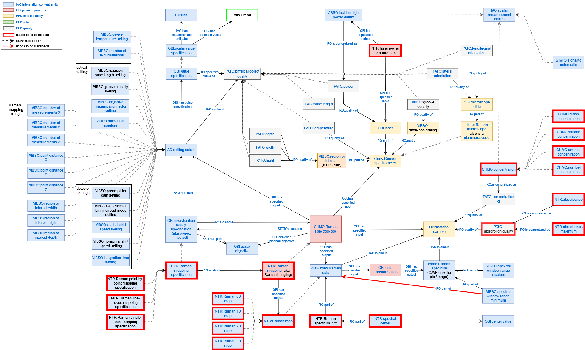

# Design Patterns & Decisions
 
**This page is will be updated regularly in the iterative development of VIBSO to document modeling decisions and design patterns.**

Following best practices in ontology development, we will reuse well established design patterns whenever possible.

## Assay pattern
<link href="asserted_obi_assay_pattern.html" rel="import" />

This Turtle example instantiates OBI's assay pattern. The type and number of relations between the instances are based on the `rdfs:subclassOf` and `rdfs:equivalentTo` axioms asserted on OBIs assay. 
```
@prefix rdf: <http://www.w3.org/1999/02/22-rdf-syntax-ns#> .
@prefix obo: <http://purl.obolibrary.org/obo/> .
@prefix ex: <https://example.instances/> .

###  https://example.instances/AssayObjective_O
ex:AssayObjective_O rdf:type obo:OBI_0000441 .

###  https://example.instances/Assay_A
ex:Assay_A rdf:type obo:OBI_0000070 ;
           obo:BFO_0000055 ex:EvaluantRole_R ;
           obo:OBI_0000293 ex:MaterialEntity_M ;
           obo:OBI_0000299 ex:DataItem_D ;
           obo:OBI_0000417 ex:AssayObjective_O ;

###  https://example.instances/DataItem_D
ex:DataItem_D rdf:type obo:IAO_0000027 ;
              obo:IAO_0000136 ex:MaterialEntity_M .

###  https://example.instances/EvaluantRole_R
ex:EvaluantRole_R rdf:type obo:BFO_0000023 .

###  https://example.instances/MaterialEntity_M
ex:MaterialEntity_M rdf:type obo:BFO_0000040 ;
                    obo:RO_0000087 ex:EvaluantRole_R .
```

## Planned Process Pattern
 OBI's way of modeling [data and values](https://github.com/obi-ontology/obi/wiki/Data-and-Values) is a very prominent pattern in many OBO ontologies and thus one we also use. Please read their documentation in order to understand how we model values and data. Here is an illustrative example graphic from that documentation:   Using this OBI pattern allows us to differentiate data values of qualities (aka attributes) of a material entity, such as the spectroscope or sample, into data values that represent settings and those that represent measurements. From a data repository use case perspective, we might not need this fine-grained approach and defining qualities/attributes and their value specifications might suffice. Yet in order to allow the integration of VIBSO in Electronic Lab Notebooks, such a differentiation will most likely be very useful.

Lars Vogt and Tobias Kuhn demonstrate the use of this pattern within a grander research context as follows (cited from their preprint [DOI:10.13140/RG.2.2.13742.59203](http://doi.org/10.13140/RG.2.2.13742.59203), p.8):


 > Figure 3: A detailed machine-actionable representation of the metadata relating to a weight measurement datum documented as an RDF ABox graph. The representation takes the form of an ABox semantic graph following the RDF syntax. The graph documents a mass measurement process using a balance. It relates an instance of mass measurement assay (OBI:0000445) with instances of various other classes from different ontologies, specifying who conducted the measurement, where and when it took place, following which protocol and using which device (i.e., balance). The graph furthermore specifies the particular material entity that served as subject and thus as input of the measurement process (i.e., ‘objectX’), and it specifies the data that is the output of the observation, which is contained in a particular weight measurement assertion.


## Vibrational Raman Spectroscopy

Here you can see the first draft of VIBSO's terminology box that focuses on vibrational Raman spectroscopy and which also shows how VIBSO depend on reusing existing ontology classes, relations and design patterns. The initially identified needed terms, depicted here with a red border, were derived from a Raman spectrometer output.



What is needed next are iterative reviews of this draft by domain experts to expand it and to ensure that the [competency questions](competency_questions.md) of VIBSO can be answered. 